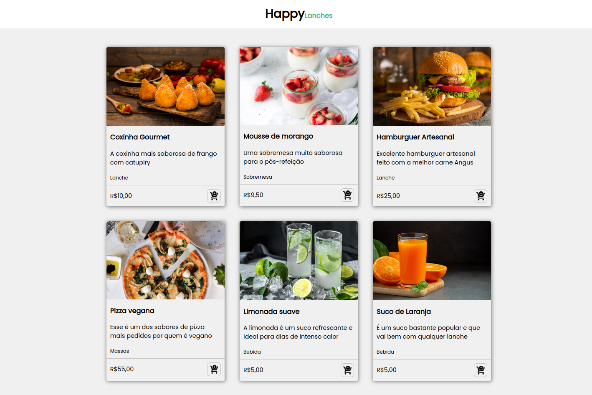

# Estudando FlexBox <h1>
Exercicio 1 é uma _**página HTML**_ que contém **cards de produtos.**

Neste exercicio teremos:

 * um __container__ _(div)_ que possui __seis cards__ _(div)_.

* Cada card do exemplo terá __quatro subcontainers__ _(div)_

* O primeiro sub container dos cards terá __uma imagem__ _(img)_

* O segundo subcontainer terá __um subtítulo__ _(h3)_ __um parágrafo__ _(p)_ e um texto _(small)_.

* O terceiro subcontainer teá __um texto__ _(span)_ e o __quarto subcontainer__ _(div)_.

* O quarto subcontainer terá __uma imagem__ _(img)_.

_Observação:  os cards devem começar a __quebrar linha__ a partir de resoluções menores que __1020px__._
